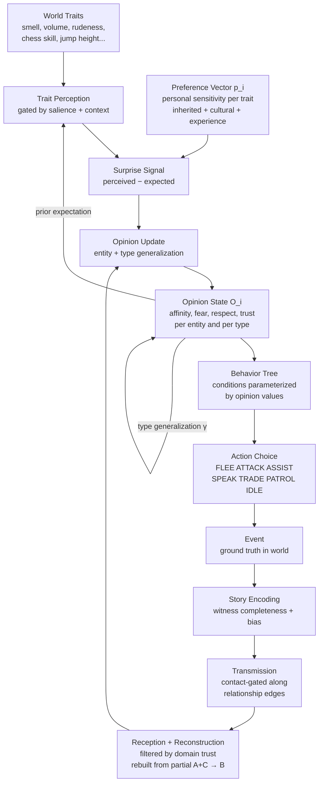
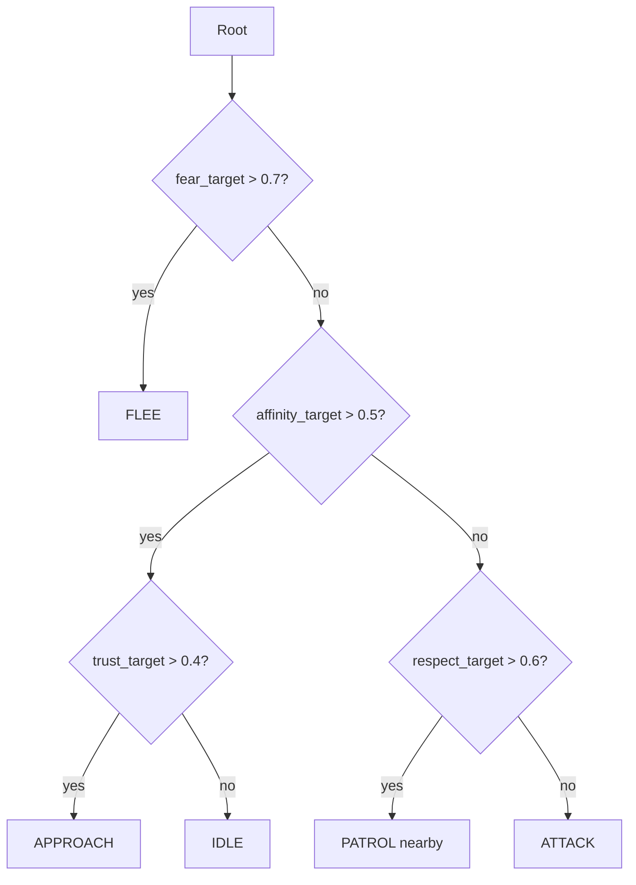

# Character Dynamics System

A design document for a simulationist character AI system combining physics-based locomotion, opinion networks, social dynamics, and emergent behavior.

> **Companion document:** [Emergent History — Time-Symmetric Causal Backfill](EmergentHistory.md) — how the world's history writes itself from sparse authoring, filling in blanks over play and generating events in *both* directions of time.

---

## The Full Feedback Loop



---

## Layer 1 — Traits

Traits are **world-defined, arbitrary observable properties** of entities. The system is agnostic to what they are; the world registers its own vocabulary.

### Trait Categories (examples)

| Category | Example Traits |
|---|---|
| Olfactory | `smell_intensity`, `pheromone_type`, `decay_odor` |
| Auditory | `volume`, `pitch`, `speech_cadence`, `laugh_type` |
| Visual | `cleanliness`, `size`, `color_pattern`, `gait` |
| Behavioral | `rudeness`, `generosity`, `hoarding_tendency`, `aggression` |
| Capability | `chess_skill`, `jump_height`, `xp_rate`, `spellcraft` |
| Social | `status`, `wealth`, `group_membership` |
| World-specific | anything — `radiation_output`, `mana_aura`, `goblin_cackle_freq` |

Traits are **data-registered** by world designers — not hardcoded into the opinion system.

### Trait Salience

Not all traits are perceptible in all contexts. Context gates which traits are active:
- Chess skill: invisible in combat, highly salient in a tavern
- Smell: irrelevant in written communication, dominant in close proximity
- Jump height: salient in pursuit, irrelevant at a dinner table

This means two entities meeting in different circumstances develop different impressions of each other — same entity, different trait windows.

---

## Layer 2 — Preferences

The **preference vector** `p_i` represents how much entity `i` cares about each trait, and in which direction.

$$\mathbf{p}_i \in \mathbb{R}^K$$

- Positive weight: you like more of this trait
- Negative weight: you dislike it
- Near zero: you don't notice or care

### Opinion from Traits (Dot Product)

$$\text{valence}_i[j] = \mathbf{p}_i \cdot \mathbf{t}_j = \sum_k p_i^k \cdot t_j^k$$

The same goblin, observed by two entities with different preference vectors, produces two completely different valence values.

### Surprise Is the Update Signal

You don't update opinions just from perceiving traits — you update from **deviation from expectation**:

$$\Delta O_i[j] \propto \mathbf{p}_i \cdot \left(\mathbf{t}_j^{\text{perceived}} - \mathbf{t}_j^{\text{expected}}\right)$$

| Scenario | Effect |
|---|---|
| Trait matches expectation | Near-zero update — stereotype reinforced |
| Trait violates expectation positively | Strong positive update — disconfirmation |
| Trait violates expectation negatively | Strong negative update |
| Long exposure | Expected value drifts toward reality — habituation |

Prejudice is mechanically a **high prior certainty** — the expected value is extreme, so the surprise signal is always small.

### Preference Inheritance

Preferences follow the same heredity rules as opinions:

$$\mathbf{p}_{\text{child}} = \alpha \cdot \mathbf{p}_{p1} + (1-\alpha) \cdot \mathbf{p}_{p2} + \mathcal{N}(0, \sigma)$$

Entire cultures develop shared aesthetic standards this way — without authoring per-entity preferences.

---

## Layer 3 — Opinion State

Each entity holds an opinion state: a collection of opinion vectors, one per known entity and per known type.

$$O_i[j] \in \mathbb{R}^D$$

### Opinion Dimensions (minimal example)

| Dimension | Meaning |
|---|---|
| `affinity` | How much you like them |
| `fear` | How threatening you find them |
| `respect` | How capable/worthy you consider them |
| `trust` | How reliable you believe them to be |

These are world-configurable. A social simulation might add `envy`, `pity`, `awe`. A political system might add `ideological_alignment`.

### Type Generalization

When entity `i` updates their opinion of individual `j` from an encounter, the group-level opinion also shifts:

$$O_i[\text{type}(j)] \mathrel{+}= s_i \cdot \delta(e) \cdot \gamma$$

`γ` (gamma) is an **essentialism** parameter — how much one individual is seen as representing their group. This is a character trait, inheritable and mutable.

### Opinion Decay (Spring Model)

$$\frac{dO_i}{dt} = -\lambda\left(O_i - O_i^{\text{prior}}\right) + \text{event impulses}$$

Opinions are constantly pulled back toward baseline. High `λ` = short memory. Low `λ` = sticky, persistent opinions.

---

## Layer 4 — Opinion Update Mechanisms

### 4A. Direct Trait Perception

Entity perceives traits of nearby entity → surprise signal → opinion update.  
Requires proximity. Continuous while in range.

### 4B. Event Testimony (Secondhand)

A story about an event is transmitted along relationship edges when entities are in contact.

**Event data structure:**
```
GroundTruthEvent {
  agents:   [entity, ...]
  sequence: [action, action, ...]
  outcome:  { entity: state, ... }
}

WitnessObservation {
  witnessed:    [partial sequence]
  missing:      [unobserved steps]
  completeness: float [0,1]
}

StoryTransmission {
  event:        WitnessObservation
  teller_bias:  teller's opinion state at time of encoding
  completeness: float
}
```

**Reconstruction (Imagination):**

When a listener receives only `A` (start) and `C` (end), they infer the missing `B`:

$$B_{\text{reconstructed}} \sim P\left(B \mid A, C, \; O_{\text{receiver}}[\text{priors}]\right)$$

Reconstruction is **biased by the receiver's own opinion priors**. Two people receiving the same incomplete story reconstruct different middle events. The world's factual record fragments into a cloud of subjective beliefs.

**Update weight:**

$$\Delta O_i = T_{ij}[\text{domain}] \cdot w_{\text{completeness}} \cdot \delta(e_{\text{reconstructed}})$$

### 4C. Direct Opinion Assertion

*"I don't trust goblins."* — No event. Stated belief, transmitted in conversation.

$$\Delta O_i[t] \mathrel{+}= T_{ij}[\text{domain}] \cdot \left(O_j[t] - O_i[t]\right) \cdot \varepsilon$$

Small, continuous drift toward trusted people's stated views.

### 4D. Behavioral Inference

Observing someone's actions → inferring their opinion → that inferred opinion bleeds into yours via trust. Implicit, ambient.

### Weight Hierarchy (default)

$$\text{firsthand experience} > \text{event testimony} > \text{behavioral inference} > \text{direct assertion}$$

Can be inverted by high trust — a trusted friend's calm assertion may outweigh a panicked firsthand observation.

---

## Layer 5 — Relationship Graph

Relationships between entities are **not flat scalars**. Each relationship is a matrix:

$$R_{ij} \in \mathbb{R}^{A \times T}$$

Where `A` = affinity aspects and `T` = trust domains.

### Affinity Aspects — What You Like *About* Someone

| Aspect | Driven by |
|---|---|
| `competence` | Watching them succeed at hard things |
| `values_alignment` | Their choices match your moral priors |
| `companionship` | Shared positive time together |
| `loyalty` | Being helped, especially at cost to them |
| `aesthetic` | Proximity and perception |
| `intellectual` | Good conversations, surprising ideas |

### Trust Domains — What Topics You Trust Them On

| Domain | Meaning |
|---|---|
| `combat_threat` | Trust their danger assessment |
| `social_read` | Trust their read on people |
| `entity_type[k]` | Trust their knowledge of specific groups |
| `moral_judgment` | Trust their ethical sense |
| `navigational` | Trust their knowledge of places |
| `material_value` | Trust their trade/object judgment |

Trust domains are also **world-registered** and arbitrary.

### Coupling

Affinity aspects and trust domains are coupled. High `intellectual` affinity tends to generate high `moral_judgment` trust. High `competence` affinity generates high `combat_threat` trust. The coupling matrix is a character trait, inheritable.

### Signed Edges (Rivalry)

Negative trust values invert influence:

$$\Delta O_i[t] \mathrel{+}= \underbrace{(-0.8)}_{\text{rival}} \cdot O_j[t]$$

If your rival loves something, you're pushed toward disliking it. In-group / out-group polarization emerges automatically from graph topology.

---

## Layer 6 — Social Influence (Graph Propagation)

$$O_i^{(t+1)} = (1-\varepsilon) \cdot O_i^{(t)\text{decayed}} + \varepsilon \sum_k w_{ik} \cdot O_k^{(t)}$$

- `w_ik` = trust of entity `i` in entity `k` (domain-matched)
- `ε` = small constant — how permeable you are to peer influence

**Emergent phenomena:**
- **Tipping points** — majority opinion flips when enough connected nodes shift
- **Echo chambers** — dense subgraphs with positive edges converge to consensus
- **Polarization** — negative edges between clusters drive them apart
- **Indirect influence** — A trusts B, B trusts C, C's opinions slowly reach A

**Constraint: contact-gated.** Social influence only propagates when entities are in physical contact or communication. Information has geography and latency.

---

## Layer 7 — Heredity

At birth, an entity inherits opinions and preferences from parents with noise:

$$O_{\text{child}}[\text{type}] = \alpha \cdot O_{p1}[\text{type}] + (1-\alpha) \cdot O_{p2}[\text{type}] + \mathcal{N}(0, \sigma)$$

- `α` — dominance weight between parents (can vary per dimension)
- `σ` — mutation/variance — low: conformist children; high: wild cards

The prior `O_prior` (the spring resting point for decay) is also set at birth and represents the character's temperamental baseline — separate from their current opinion state.

---

## Layer 8 — Behavior Selection

A small universal action vocabulary per unit:

```
FLEE | APPROACH | ATTACK | ASSIST | TRADE | SPEAK | PATROL | IDLE
```

### Behavior Tree Structure

The tree is **static in structure** but parameterized by opinion values at runtime. Condition nodes check opinion thresholds:



Different personalities (different opinion priors) use the same tree but exhibit entirely different behaviors. Personality archetypes can select *which* tree is active.

### Opinion → Action → Event

The selected action executes through the physics/animation layer and generates a world event. That event is witnessed by nearby entities, encoded into stories, and transmitted — completing the loop.

---

## Computational Notes

### Update Strategy

- **Do not update continuously.** Use an **event queue**.
- Trigger opinion updates only when:
  - An event occurs involving or witnessed by the entity
  - A relationship changes
  - Entities enter contact range (enabling social transmission)
  - A scheduled decay tick fires (infrequent)

### Complexity

| Approach | Cost per update |
|---|---|
| Fully connected (theoretical) | O(N² × D) |
| Sparse graph (practical) | O(N × k̄ × D) where k̄ = avg relationships |
| Hierarchical (distant groups as aggregates) | O(local N × k̄ × D) |

Sparse graphs are the practical target. Each entity maintains a list of meaningful relationships — typically 5–150 others — not all N entities.

### Level of Detail

Distant, unimportant entities update less frequently. Aggregate opinion of a far-away faction is a single vector, not per-member. Zoom into per-entity resolution only when proximity or interaction makes it relevant.

---

## Layer 9 — The Document as World Authority

The simulation is authored through a **world document** — a living text file that is the single source of truth. The simulation is a reading of it. Editing the document propagates changes into the running simulation.

### What the Parser Extracts

```
World Document
│
├── Rules / Physics of the World
│     → event footprints δ(e)
│     → trait vocabulary registration
│     → behavior tree action bundle availability
│
├── Entity Definitions
│     → name, type, appearance traits
│     → personality (opinion priors, susceptibility s_i, essentialism γ)
│     → location description → 3D placement
│     → preference vector p_i
│
├── Relationships
│     → natural language → R_ij matrix (affinity aspects × trust domains)
│
└── History / Pre-simulation Events
      → events applied before simulation starts
      → seeds initial opinion state from lore
```

### Example Document Schema

```yaml
world: Ashenvale

rules:
  - "Attacking a goblin near a Forest Elf causes them to become hostile"
  - "Goblins are considered sacred by Forest folk"
  - "Trade requires mutual trust above 0.3"

traits:
  - goblin_cackle_frequency
  - mana_aura_intensity
  - hoarding_tendency

entities:
  - name: Grix
    type: goblin
    location: "eastern forest clearing"
    appearance: "short, green, unusually clean"
    personality: "generous, easily startled"
    relationships:
      - Mira: "saved her life, now cautious friends"

history:
  - "Grix intervened when wolves attacked Mira"
```

The parser (structured DSL or LLM fine-tuned on the schema) reads this and produces structured data the simulation consumes:
- Trait descriptions → trait vocabulary registration
- Personality descriptions → opinion priors and preference vectors
- Relationship descriptions → R_ij matrices
- Historical events → pre-seeded opinion state
- World rules → event footprints δ(e) and action bundle configuration
- Location descriptions → 3D placement (visual instantiation is a separate pipeline)

### Scope Note

"Write a visual trait → update 3D appearance" requires procedural generation or asset-matching and is its own large pipeline. Opinion/relationship instantiation from documents is tractable now. Visual rendering from document description is future scope.

---

## Layer 10 — The Action Unification

All actions in the simulation move something in one of two spaces:

$$\Sigma_{\text{phys}} = \mathbb{R}^3 \quad \text{(3D space, physics, collision)}$$
$$\Sigma_{\text{rep}} = \mathbb{R}^D \quad \text{(trait / stat / ownership space)}$$

### The Universal Primitive

$$\text{ACTION}(\text{subject},\ \text{object},\ \Delta\sigma_{\text{phys}},\ \Delta\sigma_{\text{rep}})$$

| Action | Physical Δ | Representational Δ |
|---|---|---|
| Walk | position displacement | — |
| Attack | — | health: −δ |
| Pick up chandelier | object → hand position | ownership: world→self |
| Throw chandelier | object trajectory | damage: −δ if hits |
| Trade item | optional | item: A→B, gold: B→A |
| Cast heal | — | mana: −5, health_target: +δ |
| Persuade | — | trust: +ε, opinion: nudge |
| Build rapport | approach | affinity_companion: +ε |

Most actions touch only one space. Some touch both simultaneously. The behavior tree doesn't distinguish — it declares what moves where, and the system routes:
- Physical moves → animation / physics layer
- Representational moves → simulation / trait layer

### Two Primitive Operations

```
MOVE_PHYS(subject, object, destination)
TRANSFER(subject, trait, source_entity, target_entity, delta)
```

Named actions are **bundles of these primitives**, declared by the world document:

```
ATTACK(subject, target) =
  MOVE_PHYS(subject, subject, toward_target)
  + TRANSFER(subject, health, target, self, -damage)
  + TRANSFER(subject, stamina, self, self, -cost)

TRADE(subject, partner, item, price) =
  TRANSFER(subject, item, self.inventory, partner.inventory, 1)
  + TRANSFER(subject, gold, partner.inventory, self.inventory, price)

CAST_SPELL(subject, target, spell) =
  TRANSFER(subject, mana, self, world, -spell.cost)
  + TRANSFER(subject, spell.effect_trait, target, self, spell.delta)
```

A world without magic simply doesn't register `CAST_SPELL` as an available bundle. A world with chess registers `PLAY_CHESS` as a transfer of `chess_momentum`. The behavior tree is generic — the world document declares the available vocabulary.

### What This Means for Authoring

The world document now defines:

1. **Trait vocabulary** — what dimensions exist in Σ_rep
2. **Named action bundles** — valid combinations of primitives in this world
3. **Rules as event footprints** — when bundle X fires near entity type Y, δ(e) = ...

The behavior trees themselves are generic and reusable across worlds.

---

## Summary: The Closed Loop

```
1. Author writes world document (entities, rules, traits, history, relationships)
2. Parser instantiates: trait vocabulary, entity opinion states, relationship graph
3. Trait perception → surprise signal → opinion update
4. Opinion state parameterizes behavior tree conditions
5. Behavior tree selects named action bundle
6. Action executes as MOVE_PHYS + TRANSFER primitives
7. Execution generates world event
8. Event witnessed → encoded as story (completeness + bias)
9. Story transmitted at contact → reconstructed through receiver's priors
10. Opinions drift via assertion, behavioral inference, and social influence
11. Updated opinions feed back into behavior tree → back to step 4
12. Over generations: opinions, preferences, behaviors evolve culturally
```

The authored content required:
- **World document** (entities, rules, relationships, history — in natural language or structured schema)
- **Trait vocabulary** (extracted from document or explicitly listed)
- **Event footprints** δ(e) (how action bundles emotionally land on observers)
- **Action bundles** (named combinations of MOVE_PHYS + TRANSFER valid in this world)

Everything else — cultural attitudes, emergent prejudice and reconciliation, faction politics, generational drift, social tipping points — is a mathematical consequence of the network running forward in time.
